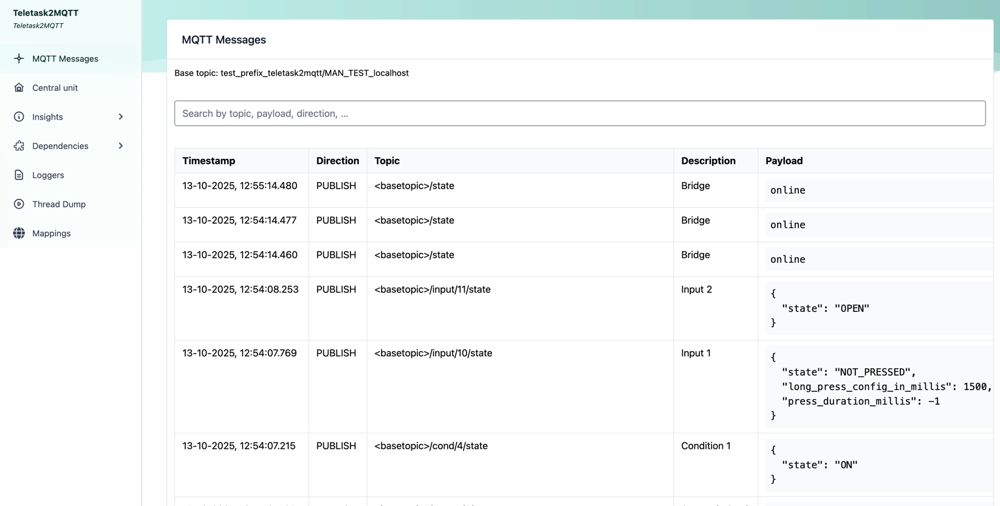
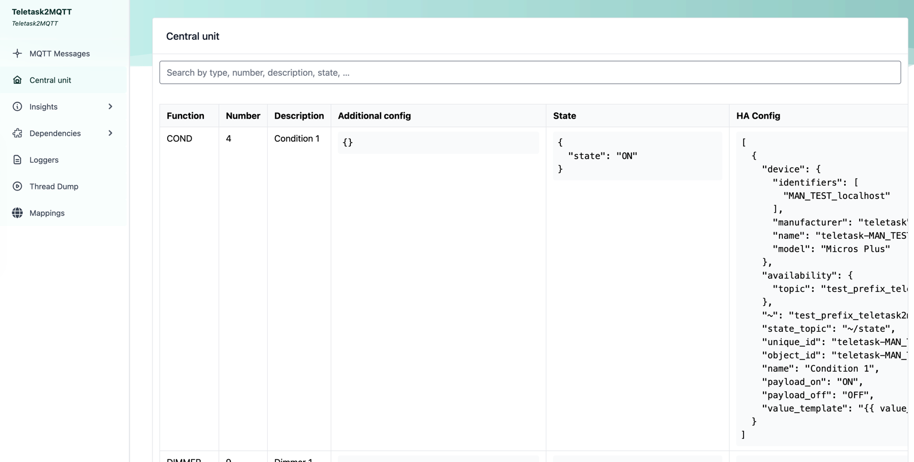

# Jeletask

An open source java API for Teletask domotics.

It is the purpose to create a MQTT bridge for software developers or domotics enthusiasts, 
who are interested in generating their own control environment for the TELETASK domotics systems,
so you can create your own user interface and connected solutions and services.

If you own a Teletask MICROS+, you need the (paid) DLL32 LIBRARY (TDS15132).  
However, if you're a java programmer like myself, you don't want to use windows dlls :-).

Teletask documentation on how their API works can be found here: https://teletask.be/media/3109/tds15132-library.pdf

The program supports the MICROS+ (maybe also NANOS/PICOS, but untested), but you'll have to buy a licence to be able to make TCP calls.

You can find the latest docker images at: https://hub.docker.com/r/ridiekel/jeletask2mqtt

# Configuring

Create a configuration json file following this example.
At this time I can only test with MICROS_PLUS. Please log an issue when you are having trouble with the other types of central unit.
If teletask has not changed their binary API, it should be compatible.

The ```type``` Can be either ```PICOS```, ```NANOS```, ```MICROS_PLUS```

```json
{
  "type": "MICROS_PLUS",
  "componentsTypes": {
    "RELAY": [
      {
        "number": 1,
        "description": "Power outlet",
        "type": "switch"
      },
      {
        "number": 23,
        "description": "Living Room - Closet lights",
        "type": "light"
      },
      {
        "number": 36,
        "description": "Living room - ceiling lights",
        "type": "light"
      }
    ],
    "SENSOR": [
      {
        "number": 1,
        "description": "Light Sensor",
        "type": "LIGHT"
      },
      {
        "number": 2,
        "description": "General Analog Sensor 1",
        "type": "GAS",
        "gas_type": "4-20ma",
        "gas_min": 0,
        "gas_max": 14,
        "decimals": 2
      },
      {
        "number": 3,
        "description": "Temperature Sensor",
        "type": "TEMPERATURE",
        "ha_unit_of_measurement": "°C"
      },
      {
        "number": 4,
        "description": "HVAC / AC",
        "type": "TEMPERATURECONTROL"
      },
      {
        "number": 5,
        "description": "Aurus wall switch in the attic",
        "type": "TEMPERATURECONTROL"
      },
      {
        "number": 6,
        "description": "Pulse counter energy Airco",
        "type": "PULSECOUNTER"
      }
    ],
    "COND": [
      {
        "number": 1,
        "description": "Condition Example"
      }
    ],
    "FLAG": [
      {
        "number": 6,
        "description": "Flag Example"
      }
    ],
    "GENMOOD": [
      {
        "number": 1,
        "description": "All off"
      }
    ],
    "MOTOR": [
      {
        "number": 1,
        "description": "Blinds"
      }
    ],
    "LOCMOOD": [
      {
        "number": 1,
        "description": "Watch TV"
      }
    ],
    "TIMEDMOOD": [
      {
        "number": 1,
        "description": "Outdoor light"
      }
    ],
    "DIMMER": [
      {
        "number": 1,
        "description": "Spots"
      }
    ],
    "INPUT": [
      {
        "number": 42,
        "description": "State of TDS12117 input nr 42",
        "long_press_duration_millis" : 2000
      },
      {
        "number": 43,
        "description": "State of TDS12117 input nr 43"
      }
    ],
    "TIMEDFNC": [
      {
        "number": 3,
        "description": "Timed function nr 3 (pulse for garage door)"
      }
    ],
    "DISPLAYMESSAGE": [
      {
        "number": 1000,
        "bus_numbers": "1,1",
        "address_numbers": "13,5",
        "description": "Aurus living room + aurus basement"
      }
    ]
  }
}
```

# Running

## Environment variables

| Variable                                         | Type     | Default value | Description                                                                                                                                                                 |
|--------------------------------------------------|----------|---------------|-----------------------------------------------------------------------------------------------------------------------------------------------------------------------------|
| TELETASK_CENTRAL_HOST                            | Required |               | The ip address or hostname of your central unit                                                                                                                             |
| TELETASK_CENTRAL_PORT                            | Required |               | The port of your central unit, probably `55957`                                                                                                                             |
| TELETASK_CENTRAL_ID                              | Required |               | The id used in mqtt messages of the central unit                                                                                                                            |     
| TELETASK_MQTT_HOST                               | Required |               | The host of your MQTT broker                                                                                                                                                |     
| TELETASK_MQTT_PORT                               | Optional | 1883          | The port of your MQTT broker                                                                                                                                                |     
| TELETASK_MQTT_USERNAME                           | Optional | <empty>       | The MQTT broker username                                                                                                                                                    |
| TELETASK_MQTT_PASSWORD                           | Optional | <empty>       | The MQTT broker password                                                                                                                                                    |
| TELETASK_MQTT_CLIENTID                           | Optional | teletask2mqtt | The client id used for connecting to MQTT                                                                                                                                   |
| TELETASK_MQTT_PREFIX                             | Optional | teletask2mqtt | The MQTT message topic prefix                                                                                                                                               |
| TELETASK_MQTT_RETAINED                           | Optional | false         | Indicates whether or not the messages should be retained by the broker                                                                                                      |
| TELETASK_MQTT_DISCOVERY_PREFIX                   | Optional | homeassistant | The MQTT home assistant discovery prefix                                                                                                                                    |
| TELETASK_DB_DIR                                  | Optional | /data         | The location for the database where all mqtt traffic is logged                                                                                                              |
| TELETASK_TRACE_RETENTION                         | Optional | P30D          | Period to keep trace of published and received messages. ([Formatting](#duration-and-period-notation))                                                                      |
| TELETASK_TRACE_CLEANUP_ENABLED                   | Optional | true          | Do a periodic cleanup of old messages.                                                                                                                                      |
| TELETASK_TRACE_CLEANUP_INTERVAL                  | Optional | P1D           | When to check for old messages. ([Formatting](#duration-and-period-notation))                                                                                               |
| TELETASK_PUBLISH_MOTOR_POSITION                  | Optional | true          | Publish the position of the motor                                                                                                                                           |
| TELETASK_PUBLISH_MOTOR_POSITION_INTERVAL         | Optional | 250           | How frequently the position is published when the motor is running (in milliseconds).                                                                                       |
| TELETASK_PUBLISH_STATES_INTERVAL                 | Optional | 300           | How frequently the states are force refreshed (in seconds). A negative value disables the force refresh of states.                                                          |
| TELETASK_LOG_HACONFIG_ENABLED                    | Optional | false         | (Advanced) Log the homeassistant config messages                                                                                                                            |
| TELETASK_LOG_TOPIC_ENABLED                       | Optional | false         | (Advanced) Add the topic name to the log message                                                                                                                            |
| LOGGING_LEVEL_IO_GITHUB_RIDIEKEL_JELETASK_MQTT   | Optional | INFO          | (Advanced) log level of messages going from/to teletask central unit. <br/>Can be `ERROR` (least log messages), `WARN`, `INFO`, `DEBUG` or `TRACE` (extensive log messages) |
| LOGGING_LEVEL_IO_GITHUB_RIDIEKEL_JELETASK_CLIENT | Optional | INFO          | (Advanced) log level of messages going from/to mqtt. <br/>Can be `ERROR` (least log messages), `WARN`, `INFO`, `DEBUG` or `TRACE` (extensive log messages)                  |
| SPRING_SECURITY_USER_NAME                        | Optional | Random UUID   | The username with which you can login to the admin console.                                                                                                                 |
| SPRING_SECURITY_USER_PASSWORD                    | Optional | Random UUID   | The password with which you can login to the admin console.                                                                                                                 |
| SPRING_OUTPUT_ANSI_ENABLED                       | Optional | Always        | To disable log coloring, set this value to `Detect` or `Never`                                                                                                              |

### Duration and Period notation

|     Duration Type      |   ISO 8601 Format    |            Description             |
|------------------------|----------------------|-------------------------------------|
| 1 Day                  | P1D                  | Represents 1 day.                  |
| 2 Weeks                | P2W                  | Represents 2 weeks (14 days).      |
| 3 Months               | P3M                  | Represents 3 months.               |
| 1 Year                 | P1Y                  | Represents 1 year.                 |
| 1 Year and 2 Months    | P1Y2M                | Represents 1 year and 2 months.    |
| 1 Day and 12 Hours     | P1DT12H              | Represents 1 day and 12 hours.     |
| 5 Hours and 30 Minutes | PT5H30M              | Represents 5 hours and 30 minutes. |
| 45 Minutes             | PT45M                | Represents 45 minutes.             |
| 30 Seconds             | PT30S                | Represents 30 seconds.             |
| 2 Days, 4 Hours,       | P2DT4H20M            | Represents 2 days, 4 hours, and    |
| and 20 Minutes         |                      | 20 minutes.                        |

See also: https://medium.com/@tbwin/mastering-iso-8601-durations-a-handy-cheat-sheet-for-developers-f40d79fd330c

## Docker run

After starting the container, you should be able to login to the web admin console via:

http://localhost:8080/

I do advise adding a reverse proxy that provides https capabilities to expose the admin interface securely.

More info about the admin interface can be found [here](#admin-interface)

### Versions

Different versions (tags) are provided.

The image is now built using multiarch setup (since 5.x.x).
Docker will automatically use the correct image for your architecture.

I advise using the `latest` tag.

Test versions are published using the `alpha` tag.

### Command line

You should be able to run using following minimal command:

```shell
docker run --name jeletask2mqtt \
  -v "<path_to_your_confg_json>:/teletask2mqtt/config.json" \
  -e TELETASK_CENTRAL_HOST="<teletask_central_ip_address>" \
  -e TELETASK_CENTRAL_PORT="<teletask_central_port>" \
  -e TELETASK_CENTRAL_ID="<teletask_central_id>" \
  -e TELETASK_MQTT_HOST="<mqtt_host>" \
  -p "8080:8080" \
  ridiekel/jeletask2mqtt:latest
```

### Docker compose

In this example you can see we added and MQTT server.
Usually you would already have that in your network.
In that case you can remove the mqtt service from the docker-compose file and point the `TELETASK_MQTT_HOST` variable to the correct host.

```yaml
services:
  mqtt:
    image: eclipse-mosquitto
    restart: unless-stopped
    volumes:
      - $HOME/.jeletask/mosquitto/data:/mosquitto/data
      - $HOME/.jeletask/mosquitto/logs:/mosquitto/logs
    ports:
      - "1883:1883"
    networks:
      - jeletask
    command: "mosquitto -c /mosquitto-no-auth.conf" #Needed for unauthenticated mqtt broker with listen address 0.0.0.0

  jeletask2mqtt:
    image: ridiekel/jeletask2mqtt:latest-native
    restart: unless-stopped
    volumes:
      - $HOME/.jeletask/teletask2mqtt/config.json:/teletask2mqtt/config.json
      - db_data:/data
    environment:
      TELETASK_CENTRAL_HOST: 192.168.0.123
      TELETASK_CENTRAL_PORT: 55957
      TELETASK_CENTRAL_ID: my_teletask
      TELETASK_MQTT_HOST: mqtt
    ports:
      - "8080:8080"
    depends_on:
      - mqtt
    networks:
      - jeletask

volumes:
  db_data:

networks:
  jeletask:
```

If you already have an MQTT server running somewhere, you can remove the mqtt service from the docker-compose.yml.

# Admin interface

You can login to the admin interface using the credentials provided in the environment variables.
If you did not provide credential information, credentials are randomly generated on every boot.

Both views support searching for strings in the records.

## MQTT Messages



Messages should appear in the interface as they are sent and received.

## Central Unit



The state of components should be updated as it changes.

# HomeAssistant

Auto configuration should work with relays, dimmers, motors, sensors, timed functions, flags, general/local/timed moods, conditions and digital inputs.
Other types are not yet supported, work in progress.
Please log an issue when having trouble with auto configuration in HA.

The bridge creates 1 device with id ```teletask-<TELETASK_CENTRAL_ID>```, and adds entities with the following entity id pattern: ```light.teletask_<TELETASK_CENTRAL_ID>_<FUNCTION_TYPE>_<COMPONENT_NUMBER>```, which should be unique for your installation.

Examples:

```
switch.teletask_my_teletask_relay_1
light.teletask_my_teletask_relay_36
```

For more information on setting and getting state using MQTT (if you want to do this manually), please see the [MESSAGES.md](MESSAGES.md) file.

## Additional HA config

### Relay

The default type of relay is ```light```, but can be overridden.
Possible values: https://www.home-assistant.io/docs/mqtt/discovery/#lighting

```json
{
  "RELAY": [
    {
      "number": 1,
      "description": "Power outlet",
      "type": "switch"
    },
    {
      "number": 23,
      "description": "Living Room - Closet lights",
      "type": "light"
    },
    {
      "number": 36,
      "description": "Living room - ceiling lights",
      "type": "light"
    }
  ]
}
```

# Developing

## Running

You can test the code against an in memory central unit test server (digital twin).
This test server mocks commands and events sent to and received from the teletask central.

In the test source tree, there is a `io.github.ridiekel.jeletask.Teletask2MqttTestApplication` class. 
When you start that class, you should have a fully working application with 2 docker containers started in the background:
* Home assistant
* MQTT
Also, the test server `io.github.ridiekel.jeletask.server.TeletaskTestServer` is started in the background.

All three services start on a random available port that is logged in the console.

Mocks can be defined in `io.github.ridiekel.jeletask.server.TeletaskTestServer`.
Mocks should already be present for the test devices that can be found in `src/test/resources/test-config.json`

## Testing

Running tests is done using:

```shell
./mvnw clean verify
```
